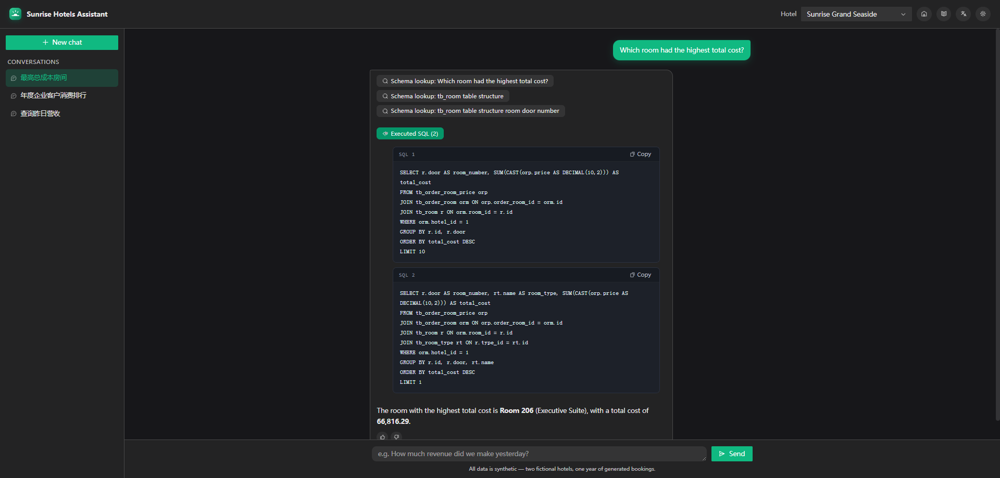
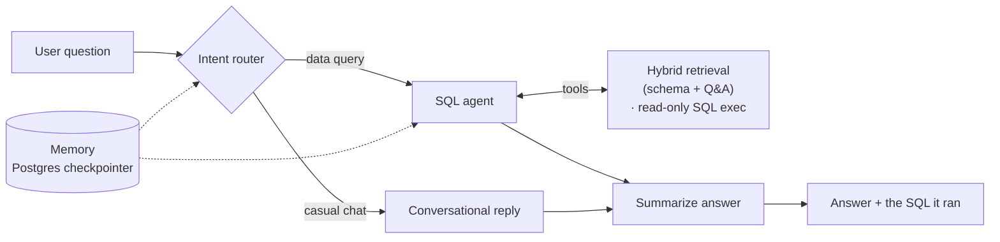

# Hotel PMS AI Assistant — Natural-Language-to-SQL Agent

> Ask a hotel's Property Management System questions in plain English and get answers straight from the database — no SQL required.

**[▶ Live demo](https://pms.bro9.vip)**  ·  Built on **LangGraph**  ·  *All data in the demo is 100% synthetic.*

  

---

## The problem

Hotel staff need operational numbers all day — *tonight's occupancy, yesterday's revenue by payment type, which agreement companies spend the most* — but that data lives behind SQL and a large PMS schema (40+ tables in the production system this was built for). Most staff can't write SQL, and analysts burn time on repetitive ad-hoc queries.

This agent turns plain-English questions into **correct SQL against a real-world hotel schema** and answers in natural language, so anyone can self-serve.

## What it does

- **Natural language → SQL → natural-language answer** over a multi-table hotel PMS schema (19 tables in the live demo).
- **SQL transparency.** Every answer shows the exact query it ran (collapsible) — staff can trust it, analysts can copy and reuse it.
- **Intent routing.** A LangGraph state machine tells casual chat from data queries and routes each down the right path instead of blindly hitting the database.
- **Hybrid retrieval + rerank.** Schema and example-Q&A knowledge are retrieved from a vector store and reranked to pick the right tables *before* SQL generation — this is what keeps accuracy high on a large schema.
- **Conversational memory.** Multi-turn follow-ups ("what about last week?") work, with pruning to control token cost (LangGraph checkpointer).
- **Safe execution.** Read-only, prefix-whitelisted SQL only — no writes, no destructive statements.
- **Bilingual.** Answers follow the language of the question (English / 中文).

## How it works

The agent classifies intent, retrieves and reranks the relevant tables, generates SQL, executes it read-only, and summarizes the result in plain language — carrying conversation state across turns.

## Tech stack

| Layer | Technology |
|-------|-----------|
| Agent / LLM | LangGraph, LangChain, OpenAI |
| Retrieval | ChromaDB, multilingual-e5 embeddings, hybrid retrieval + rerank |
| Backend | FastAPI, async SQLAlchemy, MySQL |
| Agent memory | LangGraph checkpointer on PostgreSQL |
| Demo UI | React 18 + TypeScript + Arco Design (SSE streaming) |

## About the demo

- **Synthetic data only** — a 19-table subset with two fictional hotels, ~150 rooms, ~12 months of orders, billing, members and agreement companies. No real guest or business data.
- LLM calls are rate-limited and preset questions are cached, so the public demo stays cheap to run.
- **Source code is private** — this repository is a case study (write-up, architecture, screenshots). Happy to walk through the implementation on request.

**[▶ Try the live demo → pms.bro9.vip](https://pms.bro9.vip)**

## Who built this

Full-stack + AI engineer specializing in LLM agents, RAG, and Text2SQL/NL2SQL.

- Upwork: https://www.upwork.com/freelancers/~016600ee8394151c91
